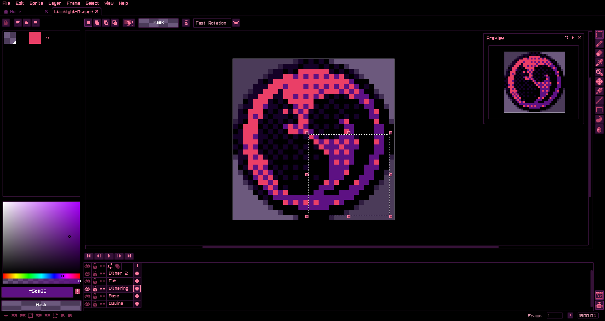
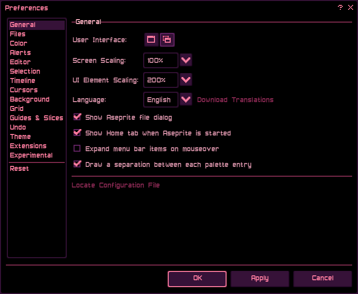
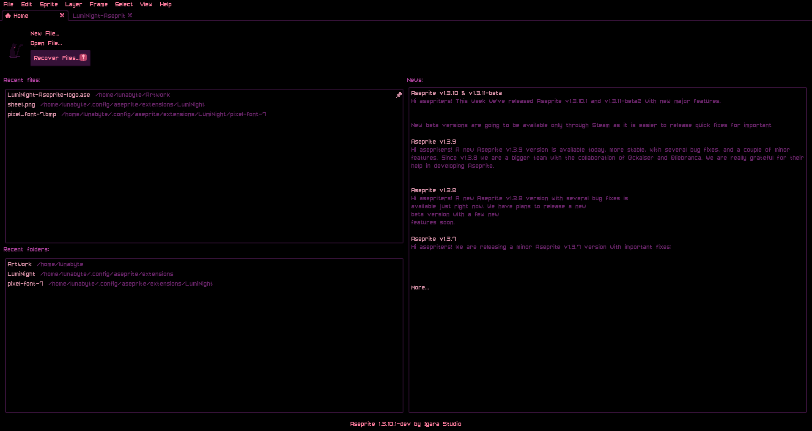
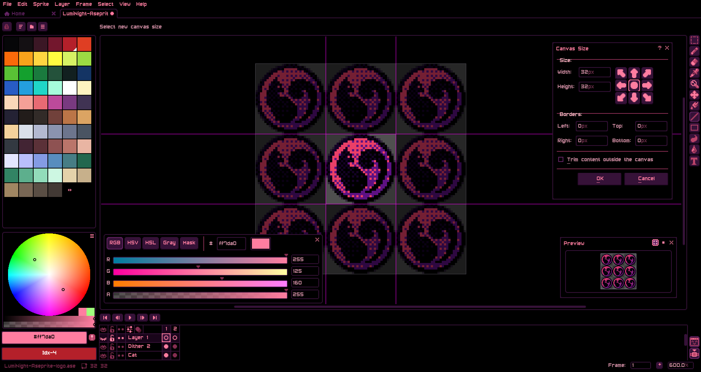

  	

# Luminight Theme for Aseprite

**LumiNight** is an OLED theme with pink/purple accents for Aseprite! This is part of the LumiNight set of themes I've created for applications I use often.

This was made for Aseprite 1.3.18.3. Using it in older/newer versions may not work!

  	
  	
  	
  	

